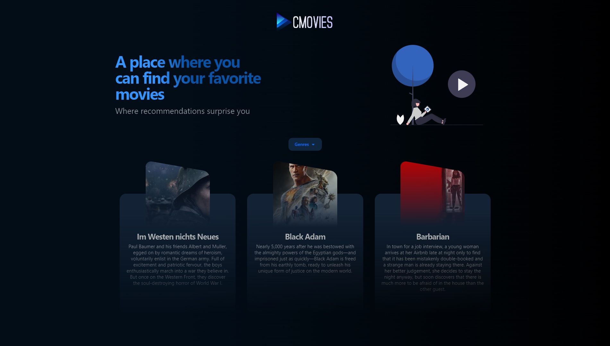

# :zap: C Movies App

Application about movies using API IMDb for studies with React, using componentization concepts, context concepts and Tremor to create components.

This application is hosted on Vercel.
- Demo: <a href="https://react-movies-seven-rho.vercel.app" target="_blank">click here</a>

## :gear: Techs used

- React JS
- Vite JS
- Typescript
- NextUI
- API IMDb
